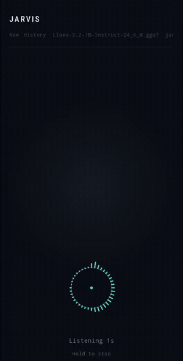

# Jarvis TTS for Android

| | |
|---|---|
| [](https://github.com/coliver/jarvis-tts-android/actions/workflows/ci.yml)<br>[](LICENSE)<br> | <br><br> |
| <br><br> | <br><br> |

A fully on-device voice assistant for Android.



Tap the mic, speak, and get a spoken response:

1. 🎙️ Records your voice
2. ✍️ Converts speech to text
3. 🧠 Generates a reply
4. 🔊 Reads the reply aloud

No server, PC, or permanent network connection is required. Models download over HTTPS the first time you use them or switch models.

> Tested end-to-end on a Pixel 8 Pro.

For architecture notes and the current backlog, see [`AGENTS.md`](AGENTS.md).

## Contents

- [How it works](#how-it-works)
- [Setup](#setup)
- [Models](#models)
- [Session history](#session-history)
- [Project layout](#project-layout)
- [Native libraries](#native-libraries)
- [Exporting the TTS models](#exporting-the-tts-models)
- [Sharing the APK](#sharing-the-apk)
- [Licenses](#licenses)

## How it works

```text
Tap the mic
      ↓
Voice activity detection
      ↓
Whisper.cpp — speech to text
      ↓
Tool router — time, battery, timer, email, Wikipedia (skips the LLM on a match)
      ↓
Llama.cpp — generates a reply
      ↓
Pocket-TTS / omatts — text to speech
      ↓
AudioTrack — streams the audio
```

- Recording stops automatically when you stop speaking; there's no button to hold down.
- All three engines warm up in parallel when the app starts, each with its own loading/download progress.
- Hold the mic at any point — listening, thinking, or speaking — to cancel that turn immediately. While speaking, a tap pauses or resumes playback.
- Simple requests (time, battery, timers, drafting an email, Wikipedia lookups) are matched by keyword before the LLM and answered directly by the app.
- Recent turns from the current conversation are included in each prompt, so follow-up questions work without repeating context, bounded by the loaded model's context window.

## Setup

You do not need Android Studio. Everything below runs from a WSL/Linux command line.

### 1. Get the toolchain

The project keeps its own toolchain inside the repository's gitignored `.toolchain/` directory, so nothing needs to be installed system-wide:

| Tool | Version |
|---|---|
| JDK | 17 (Temurin) |
| Android command-line tools | latest |
| Android platform | 34 |
| Android Build Tools | 34.0.0 |
| Android NDK | 27.2.12479018 |
| CMake | 3.31.6 (3.28+ required) |
| Ninja | latest |

### 2. Point Gradle at the SDK

Create or edit `local.properties` in the repo root:

```text
sdk.dir=<repo>/.toolchain/android-sdk
```

### 3. Set environment variables

```bash
export JAVA_HOME=<repo>/.toolchain/jdk-17.0.20.1+1
export ANDROID_HOME=<repo>/.toolchain/android-sdk
```

### 4. Build

```bash
./gradlew assembleDebug
```

The APK is written to:

```text
app/build/outputs/apk/debug/app-debug.apk
```

### 5. Test and lint (optional)

```bash
./gradlew testDebugUnitTest     # unit tests
./gradlew ktlintCheck           # lint
./gradlew ktlintFormat          # auto-fix formatting
./gradlew jacocoTestReport      # coverage report
```

### 6. Install on your phone

On native Linux (or macOS, or WSL with USB passthrough already configured), plug the phone in over USB, enable **USB debugging** in Developer Options, and run:

```bash
adb install app/build/outputs/apk/debug/app-debug.apk
```

If `adb devices` shows the phone as `unauthorized`, accept the RSA key prompt on the phone screen and re-run it. If it shows `no permissions`, your user likely needs a udev rule for the device — see [Android udev rules](https://github.com/M0Rf30/android-udev-rules) — or fall back to `sudo adb install ...`.

**WSL2 usually can't reach a phone over USB directly**, since there's no USB passthrough by default. Use one of these instead:

<details>
<summary><strong>Option A — Wireless debugging</strong></summary>

1. Enable **Wireless debugging** in Android Developer Options.
2. Pair the phone:

   ```bash
   adb pair <phone-ip>:<pairing-port>
   ```

3. Connect to the phone:

   ```bash
   adb connect <phone-ip>:<port>
   ```

4. Install the APK:

   ```bash
   adb install app/build/outputs/apk/debug/app-debug.apk
   ```

This can be unreliable during large file transfers.

</details>

<details>
<summary><strong>Option B — Windows ADB over USB</strong></summary>

Use this if Windows already detects the phone with ADB.

1. Build the APK in WSL (step 4 above).
2. Copy it to a Windows-visible path:

   ```bash
   cp app/build/outputs/apk/debug/app-debug.apk \
     /mnt/c/Users/<you>/AppData/Local/Temp/
   ```

3. Install it from PowerShell using Windows' `adb`:

   ```powershell
   adb install $env:TEMP\app-debug.apk
   ```

Note: `adb install` does not work directly with UNC paths such as `\\wsl.localhost\...`.

</details>

## Models

### Speech-to-text

| | |
|---|---|
| Engine | `whisper.cpp` |
| Default model | `ggml-base.en-q5_1.bin` (~57 MB) |
| Download | Hugging Face, on first use (SHA-256 verified) |

### Language model

| | |
|---|---|
| Engine | `llama.cpp` |
| Default model | `Llama-3.2-1B-Instruct-Q4_K_M.gguf` (~770 MB) |
| Download | Hugging Face, on first use (SHA-256 verified) |

To use a different llama.cpp-compatible model, push it to the device and select it from the model picker in the top bar while the app is idle:

```bash
adb push model.gguf \
  /sdcard/Android/data/com.jarvistts/files/llm/
```

Chat formatting is detected automatically from the loaded model — no code changes needed.

### Text-to-speech

| | |
|---|---|
| Engine | Pocket-TTS through [`parnoldx/omatts`](https://github.com/parnoldx/omatts) |
| Models | Bundled in `app/src/main/assets/` |
| Download | Not currently available for the custom-exported models |

Five voice samples ship in `app/src/main/assets/voices/`, each paired with a personality prompt in `app/src/main/assets/personas.json`: `jarvis`, `guinan`, `data`, `picard`, and `enterprise`. Pick one from the voice picker in the top bar while the app is idle.

STT and LLM models are downloaded instead of bundled so the APK stays around **175 MB**, rather than approaching 1 GB.

## Session history

Every conversation is saved automatically as it happens — there's no manual save step.

- **New** starts a fresh conversation. The current one is saved first if it has any turns.
- **History** lists saved conversations. Tap one to resume it, tap **x** to delete it, or choose **Delete all** (with a confirmation) to clear everything.
- Titles are generated automatically from the first thing you said.

Sessions are stored as JSON files under the app's internal `files/sessions/` directory. A session is written after every completed, stopped, or errored turn, so a killed or backgrounded app loses at most the single in-flight turn.

There is currently no size cap or automatic pruning — sessions accumulate indefinitely. Each one is small, so this is unlikely to matter in practice.

## Project layout

```text
app/src/main/
├── java/com/jarvistts/
│   ├── MainActivity.kt      Activity lifecycle, coroutines, AudioRecord, and AudioTrack
│   ├── JarvisScreen.kt      Jetpack Compose UI
│   ├── NativeSTT.kt         JNI declarations for whisper.cpp
│   ├── NativeLLM.kt         JNI declarations for llama.cpp
│   ├── NativeBridge.kt      JNI declarations for the TTS engine
│   ├── VoicePipeline.kt     Transcript cleanup, VAD, and testable voice logic
│   ├── ModelManager.kt      Model discovery, download URLs, and model selection
│   ├── ModelDownloader.kt   Model downloads and progress reporting
│   ├── ChatSession.kt       Saved-conversation data model and JSON encode/decode
│   ├── SessionStore.kt      Filesystem CRUD for saved conversations
│   ├── Tools.kt             Tool routing, prompt text, and spoken-email cleanup (pure, testable)
│   ├── ToolRunner.kt        Android side of the tools: time, battery, timer, email intent
│   ├── WebSearch.kt         Wikipedia lookup
│   ├── MiniJson.kt          Dependency-free JSON reader and writer used by SessionStore
│   ├── Markdown.kt          Minimal markdown parsing so LLM replies render (and are spoken) cleanly
│   └── BreakoutGame.kt      A small hidden game shown while models are loading
│
├── cpp/
│   ├── CMakeLists.txt
│   ├── omatts.cpp
│   ├── jni_bridge.cpp
│   ├── stt_jni_bridge.cpp
│   └── llm_jni_bridge.cpp
│
├── assets/
│   ├── models/               TTS ONNX models and tokenizer
│   ├── voices/                jarvis.wav, guinan.wav, data.wav, picard.wav, enterprise.wav
│   └── personas.json          Personality prompt paired with each voice
│
└── src/test/java/com/jarvistts/
    ├── VoicePipelineTest.kt
    ├── SessionStoreTest.kt
    ├── SessionCodecTest.kt
    ├── MiniJsonTest.kt
    ├── ModelDownloaderTest.kt
    ├── ToolsTest.kt
    ├── WebSearchTest.kt
    ├── MarkdownTest.kt
    └── ModelManagerTest.kt
```

STT and LLM models are not included in `assets/` — they download the first time they're needed. The TTS model is currently bundled with the app.

## Native libraries

The native build creates three shared libraries:

| Library | Contains |
|---|---|
| `jarvis_tts` | omatts and ONNX Runtime |
| `jarvis_stt` | whisper.cpp |
| `jarvis_llm` | llama.cpp |

The build intentionally forces Release mode (`CMAKE_BUILD_TYPE=Release`). This matters: without it, an Android Gradle Plugin issue can silently produce builds that are **30–80× slower**. See [`AGENTS.md`](AGENTS.md) for the full explanation.

## Exporting the TTS models

The bundled ONNX models were generated using omatts's `export_onnx.py`.

1. Check out this specific Pocket-TTS commit — later versions removed or renamed modules the export script needs:

   ```text
   kyutai-labs/pocket-tts
   commit: 7db278e
   ```

2. Install the pinned checkout without its dependencies:

   ```bash
   pip install --no-deps <path-to-pocket-tts-checkout>
   ```

3. Set up the export environment: `pocket-tts`, `torch`, `onnx`, `onnxruntime`.

4. Run the export:

   ```bash
   python export_onnx.py
   ```

   This exports five models, quantizes three of them to INT8, stores large weights in `.onnx.data` sidecar files, and keeps one default variant per model.

5. Copy the generated directory into `app/src/main/assets/models/`.

## Sharing the APK

The debug APK can be sideloaded onto another device. The receiving device needs:

- Android 8.0 or newer
- An ARM64 processor
- Permission to install unknown apps

The APK is approximately **175 MB**. Good transfer options include a Drive link, USB, or local file transfer — avoid sending it as a chat attachment.

### Publishing a GitHub Release

The voice samples in `app/src/main/assets/voices/` are gitignored, so the APK built by CI (the `debug-apk-no-voices` artifact) has no voices and is not meant for sharing. Build locally, then attach that APK to a Release to get a stable link:

```bash
./gradlew assembleDebug
gh release create v0.1 app/build/outputs/apk/debug/app-debug.apk \
  --title "v0.1" --notes "Debug build, arm64 only."
```

The link is `https://github.com/<user>/jarvis-tts-android/releases/latest`. The repo must be public for it to work without a GitHub login.

## Licenses

| | |
|---|---|
| Project code and `omatts.cpp` | MIT |
| `whisper.cpp` | MIT |
| `llama.cpp` | MIT |
| TTS model weights | CC-BY-4.0 |
| ONNX Runtime | MIT |
| SentencePiece, AndroidX, Jetpack Compose, kotlinx.coroutines | Apache 2.0 |
| Whisper model (downloaded) | MIT |
| Llama 3.2 model (downloaded) | [Llama 3.2 Community License](https://www.llama.com/llama3_2/license/) (commercial use allowed, attribution required, not OSI open source) |

Full attribution: [`THIRD_PARTY_NOTICES.md`](THIRD_PARTY_NOTICES.md)
TTS weight license: [`app/src/main/assets/models/LICENSE-WEIGHTS.txt`](app/src/main/assets/models/LICENSE-WEIGHTS.txt)
